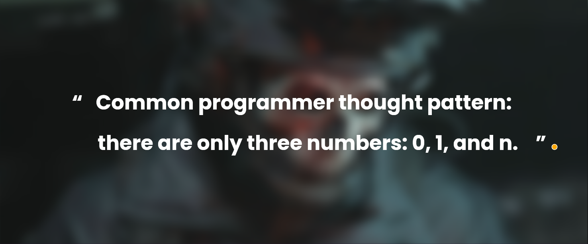

##  About me

Aspiring Computer Science student and competitive programmer with a passion for continuous learning and exploration of diverse technologies. Eager to contribute as a valuable team member engaged in a spectrum of projects featuring cutting-edge technologies. Known for excellent problem-solving and analytical abilities, complemented by strong communication skills. Seeking an internship opportunity to apply and enhance technical expertise while actively contributing to innovative software development projects.
 

 
<!-- ##  Top Repositories

 -->

 

##  Connect with me

	
	
	
	
	

##  My Skills

###  Programming languages

  
  &emsp;
   
  &emsp;
  
  &emsp;
  
  &emsp;
   

###  Frontend Development

 
  &emsp; 
     
  &emsp;
   
  &emsp;
  
  &emsp;
  

###  Backend Development

&emsp;
 
 &emsp;
  
   &emsp;
  
  &emsp;
  

###  Competitive Programming & Problem Solving

  &emsp;
    	
  &emsp;
    
  &emsp;
    

###  Operating Systems

  &emsp;
    
  &emsp;
    
  &emsp;
    

 

---

 

	

